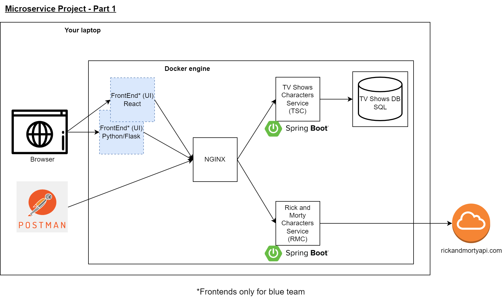
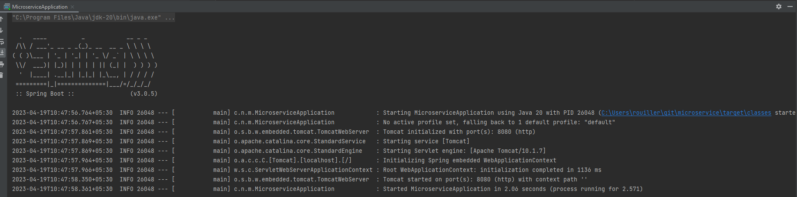
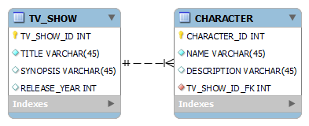

# Second assignment - Microservice: Part 1

## Introduction
This is the second assignment. During this project, you will build microservices and make them interact together in a prod-like deployment. You will implement services that return pieces of information about various tv-shows. 

In this first part, we will focus on implementing a basic infrastructure with services implementing REST APIs and fetching data from various sources.
In the second part, you will extend the functionalities of each service, improve the infrastructure and automate the delivery of your applications.

## Execution
You will be working in a group of three to four people. For each service described below, there is a recommendation regarding which team member should pick up that implementation. 

## Objective
You will need to set up the infrastructure below made of docker containers :
  

## Initial setup in Intellij (for Java developers)
In this repository, you can find a dummy API that returns a Hello World message. You can start from this to create your own service.
1. Open the project in IntelliJ.
2. Select the JDK 20 for the project.
3. Download the Maven dependencies (it should happen automatically in the background).
4. Run the program, you should see your spring boot server log :

5. Looking at the server logs, find out how to access the web server from your browser.
    - You should be able to see a "Hello World" message using the correct URL from your browser.

# Services
All services will run in dedicated docker containers, including frontends, DB and NGINX. Both Java services will implement a REST API.

Each service will need a dedicated GitHub repo (one repo per service per group). Everything required to deploy your whole project must be pushed on these repositories (source code, Dockerfile, configuration files, DB scripts, ...).
## DB (For Java developers or SRE)
In the first stage, you will create a schema for your DB and manually insert records using SQL commands. The DB must be running in a docker container.
You will need to implement that schema (the fields with a white diamond symbol are optional when inserting data in DB) :

You are free to use any kind of SQL database.

## TV Shows Characters Service - TSC (for Java developers)
This service will run on SpringBoot and interact with the DB to provide data back to the user. 

You will need to implement the endpoint below to fetch data previously inserted in the DB using hibernate. The response is in JSON format.

Here are the three interfaces that you will need to implement, with an example for the tv_shows with id 1 :

    
    Method : GET
    Endpoint : /api/v1/shows
    HTTP Code : 200
    Returns :
    {
        "shows": [
            {
                "id": 1,
                "title": "...",
                "synopsis": "...",
                "release_year": "..."
            },
            {
                "id": 2,
                "title": "...",
                "release_year": "..."
            },
            {
                "id": 3,
                "title": "...",
                "synopsis": "..."
            },
            {
                "id": 4,
                "title": "...",
                "synopsis": "...",
                "release_year": "..."
            }
        ]
    }
    
    Method : GET
    Endpoint : /api/v1/shows/1
    HTTP Code : 200
    Returns :
    { 
        "id": 1
        "title" : "..."
        "synopsis" : "..."
        "release_year" : "..."
    }

    Method : GET
    Endpoint : /api/v1/shows/1/characters
    HTTP Code : 200
    Returns :
    {
        "characters": [
            {
                "id": 1
                "name": "...",
                "description": "..."
            },
            {
                "id" : 14
                "name": "...",
                "description": "..."
            },
            {
                "id" : 20
                "name": "..."
            }
        ]
    }

In case the show with id 1 is not found, you should return an empty payload with an HTTP Code 404 (not found).

## Rick and Morty Characters Service - RMC (for Java developers)
This service will run on Spring boot and fetch data from rickandmortyapi.com.

You will need to implement an endpoint that will fetch data about a specific character from rickandmortyapi.com and extract only the necessary information.
The results will be returned in JSON. Refer to https://rickandmortyapi.com/documentation.

Here is the interface that you will need to implement, additional pieces of information obtained from rickandmortyapi.com must not be returned:

    Method : GET
    Endpoint : /api/v1/characters/?name=rick
    Returns :
    {
        "characters": [
            {
                "id": 1,
                "name": "Rick Sanchez",
                "image": "https://rickandmortyapi.com/api/character/avatar/1.jpeg"
            },
            {
                "id": 8,
                "name": "Adjudicator Rick"
            },
            {
                "id": 15,
                "name": "Alien Rick"
            },
            {
                "id": 19,
                "name": "Antenna Rick",
                "image": "https://rickandmortyapi.com/api/character/avatar/19.jpeg"
            },
            ...
        ]
    }

Rick can be replaced with any character name.

## Nginx (For SRE)
This service will act as the entry to your deployment. You will need to redirect incoming requests to either TSC or RMC based on the request URL:

| HTTP Method | Entry endpoint on nginx    | Targeted service | Endpoint in targeted service   |
|-------------|----------------------------|------------------|--------------------------------|
| GET         | /tsc/shows                 | TSC              | /api/v1/shows/1                |
| GET         | /tsc/shows/1               | TSC              | /api/v1/shows/1                |
| GET         | /tsc/shows/1/characters    | TSC              | /api/v1/shows/1/characters     |
| GET         | /rmc/characters/?name=rick | RMC              | /api/v1/characters/?name=rick  |

## FrontEnd/UI (For blue team only: Devaiah / Varshini)
You will design a front-end website, that will display data fetched through nginx from TSC or RMC and display them in a nice way. Two implementations will be done, one in React and one in Flask.
Other teams don't need a front-end website.

Your front end will be in charge of sending GET requests to adequate endpoints. Your front end will have two sections, one section "TV Shows Characters" and another section "Rick and Morty characters". 

Below are the main guidelines. It's up to you to make a nice interface with all the information you can gather from the backend (TSC and RMC).

### First Section
- The first section of your site will display the list of tv shows with their respective details
- Clicking on one of these shows will display all characters from that specific show

### Second section
- The second section of your website will be dedicated to Rick and Morty characters
- You will have a search interface to find a specified character, multiple results are possible as shown above.

# Testing
To test your REST API services, you will use Postman. It's a simple tools to send HTTP requests and saved them to reuse them later on. 
For the blue group, which will have a UI, you will be able to test both using Postman and using your Frontend.

# Demo
When you have finish the first part of this assignment, you will need to do a demo to me using Postman and for the blue group frontends as well. 
If the interfaces are implemented as expected, I will give you the instructions for the second part of the project.
